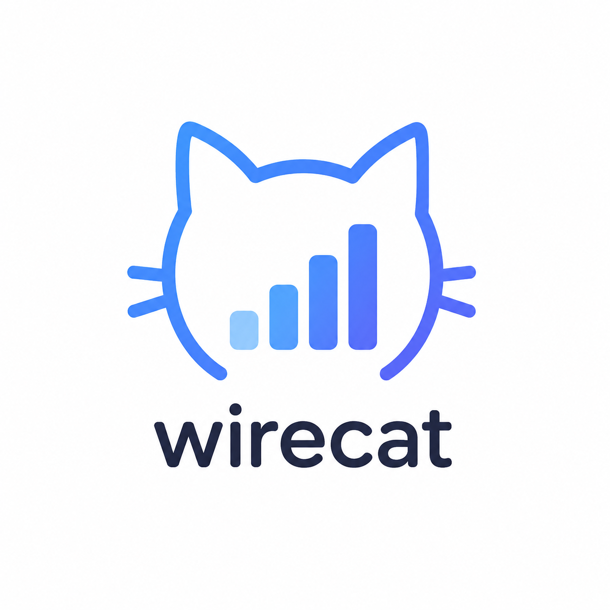

# Wirecat



**Local, per-app data usage monitor and network firewall for Android.**

Wirecat shows you exactly which apps are using your data in real time, lets you cut off any app's internet access on demand, and keeps a local log of what's actually happening on the wire, all of it running entirely on-device.

---

## Features

### Data usage monitoring
- Live, per-app data usage while a monitoring session is running (total bytes, current speed, session duration).
- Ranked per-app breakdown across Wi-Fi and mobile data, backed by Android's `NetworkStatsManager`.
- Optional packet capture during monitoring for a closer look at live traffic.

### Tunnel — block any app's internet access
- Select one or more installed apps and instantly cut off their internet access.
- Implemented with Android's `VpnService`, using `addAllowedApplication()` so *only* the apps you pick are affected — every other app on the device bypasses the tunnel completely and is untouched.
- No root required.
- **Platform limitation, not a bug:** Android allows exactly one active `VpnService` per device. Tunnel and a separate VPN app cannot both be active at the same time — this is an OS-level restriction with no workaround short of root.

### Packet log
- Every blocked (Tunnel) or captured (Monitoring) packet is logged with protocol (TCP/UDP/ICMP), IP version (IPv4/IPv6), source/destination address and port, size, and the owning app where resolvable.
- Searchable by app, protocol, or address.

### Session history
- Every monitoring session is saved locally (SQLite via a plain `SQLiteOpenHelper` — no ORM) with its full per-app breakdown, browsable later from the History screen.

### UI
- Single-Activity, fragment-based architecture (`HostActivity` + `HomeFragment` / `LogFragment` / `TunnelFragment` / `SettingsFragment`) with one persistent bottom navigation bar that is never recreated on tab switch.
- Dark and light themes.

### Privacy
- No backend of any kind. Everything Wirecat measures and logs stays in the app's local storage.
- The only network call Wirecat itself makes is to open the donation link you choose to tap.

---

## Tech stack

| | |
|---|---|
| Language | Kotlin |
| Min SDK / Target SDK | 24 / 36 |
| Build | Gradle (no wrapper — see [Building](#building)), Android Gradle Plugin 9.x |
| UI | Android Views + ViewBinding (no Compose) |
| Persistence | Plain `SQLiteOpenHelper` (no Room) |
| Networking primitives | `VpnService`, `NetworkStatsManager`, `ConnectivityManager` |
| Async | Kotlin Coroutines + `Flow` |

## Project structure

```
app/src/main/java/com/soroush/wirecat/
├── ui/               # HostActivity, fragments, adapters, BottomNavController
├── data/             # NetworkStatsHelper, MonitorService, WirecatDbHelper, PacketLogStore
├── vpn/              # TunnelVpnService, MonitorCaptureVpnService
├── util/             # FormatUtils, PermissionUtils, PrefsManager, InsetUtils
└── WirecatApp.kt      # Application class
```

## Permissions

| Permission | Why |
|---|---|
| `PACKAGE_USAGE_STATS` | Required to read per-app data usage (granted manually via system settings — Wirecat prompts for this). |
| `BIND_VPN_SERVICE` / VPN prepare flow | Powers Tunnel and optional packet capture — both are local-only, nothing is proxied off-device. |
| `FOREGROUND_SERVICE*`, `POST_NOTIFICATIONS` | Monitoring and Tunnel run as foreground services with a persistent notification, as Android requires. |
| `QUERY_ALL_PACKAGES` | Needed to list and display every installed app in the usage/Tunnel lists. |

## Building

This project intentionally does **not** ship a Gradle wrapper — it's built against a local Gradle installation.

1. Requirements: JDK 17, a local Gradle install compatible with AGP 9.x (developed against Gradle 9.7), Android SDK with `compileSdk 36`.
2. Open in Android Studio and let it sync against your local Gradle distribution (**Settings → Build Tools → Gradle → Gradle distribution → Local installation**), or build from the command line with your own `gradle` on `PATH`.
3. `gradle assembleDebug`

## Known limitations

- **Tunnel vs. other VPNs:** can't run alongside a separate VPN app (Android OS restriction — see above).
- **IPv6 relay:** live packet *capture* during monitoring currently only relays IPv4 traffic; IPv6 packets are neither forwarded nor logged by the capture service (Tunnel's blocking + logging, by contrast, fully supports IPv6).
- **No cloud sync:** history and logs are local-only by design — reinstalling the app or clearing its data erases them.
